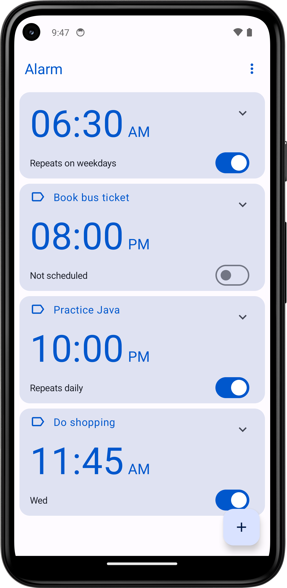
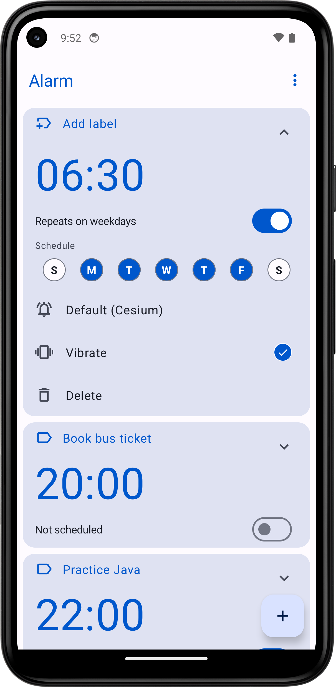
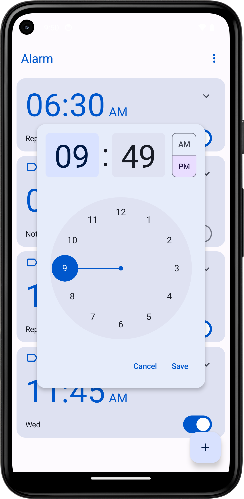

# AlarmUI: Minimalist Alarm Clock

AlarmUI is a lightweight Android application offering a sleek, retro-inspired alarm clock interface. Designed with Material Design for a modern, intuitive feel and powered by Android’s Room database for robust data persistence, it prioritizes core alarm functionality with a compact 1.21 MB footprint, ensuring no bloatware. The alarm feature is operational but under active refinement to address minor quirks and enhance performance.

Originally developed as an exploration of Room database integration, AlarmUI evolved into a public release on the Google Play Store. Future updates aim to deliver a fully polished, seamless alarm clock experience.

**[Download on Google Play](https://play.google.com/store/apps/details?id=com.samwrotethecode.clock)**

## Screenshots

| Home Screen | Alarm Details | Add Alarm |
|-------------|---------------|-----------|
|  |  |  |

## Feedback
Contributions and feedback are welcome to help refine AlarmUI. Submit issues or suggestions via GitHub or share your experience through the Play Store.